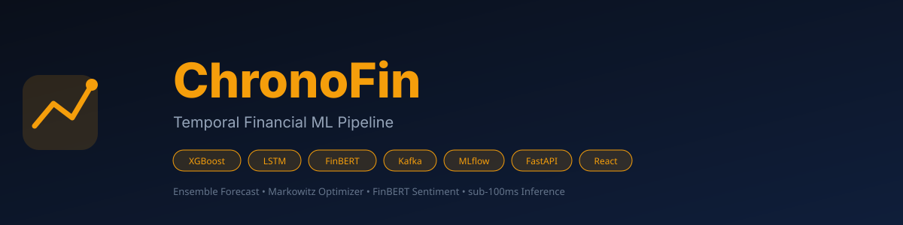
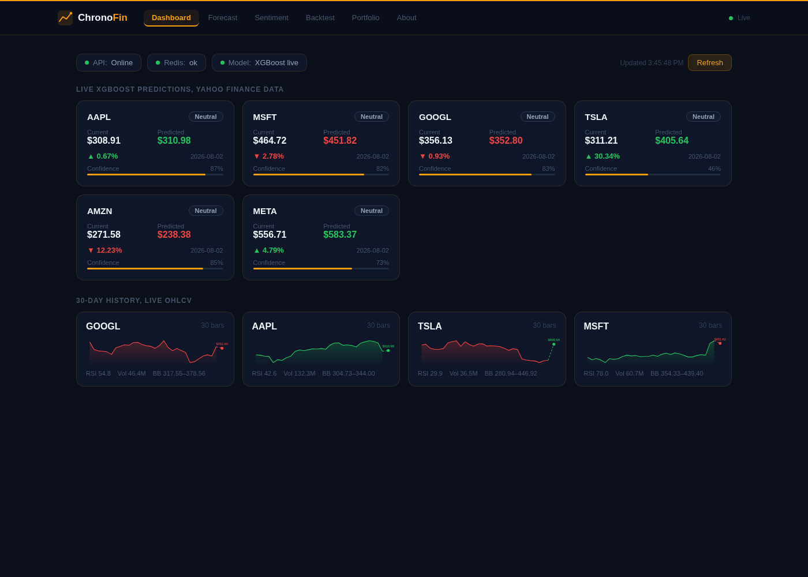
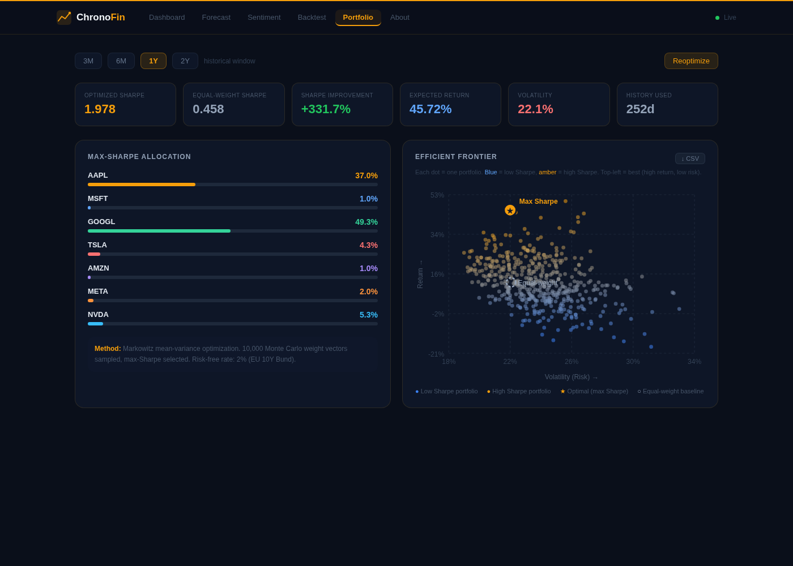
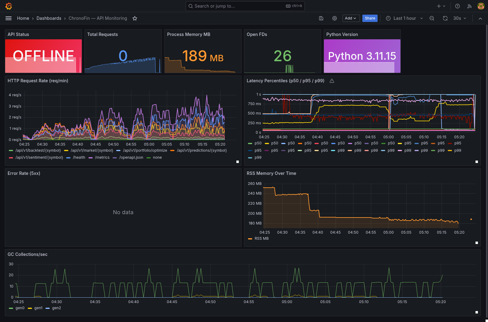
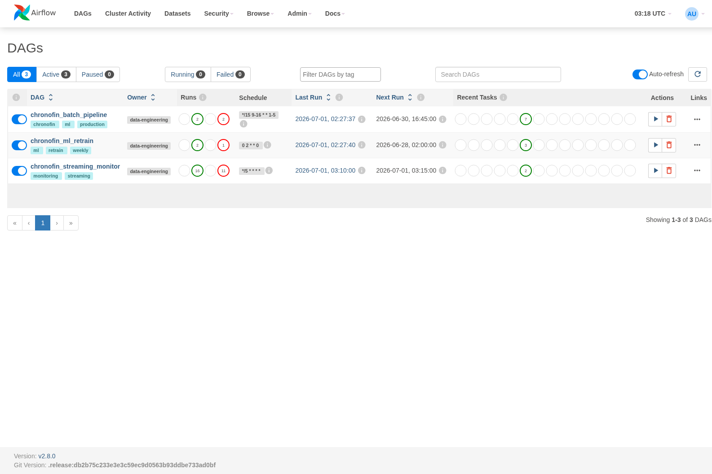
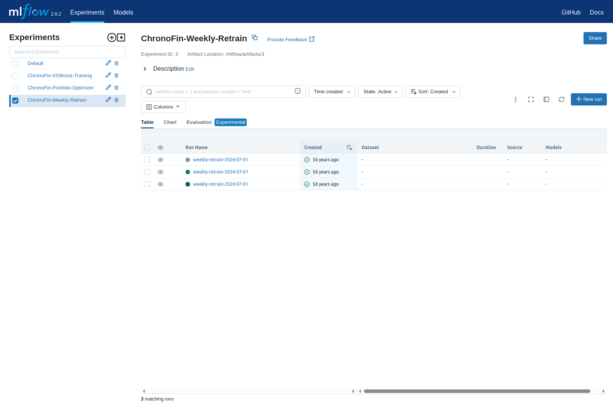
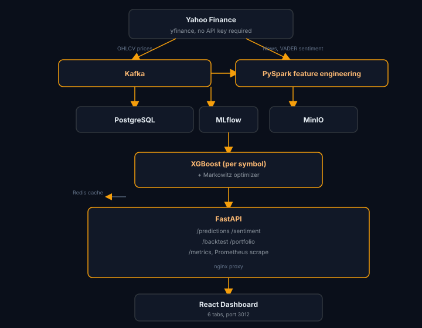

# ChronoFin

<p align="center">
  
  
  
  
  
  
  
  
</p>

<p align="center">
  <strong>Production-grade financial ML pipeline, live XGBoost forecasting · news sentiment · walk-forward backtesting · Markowitz portfolio optimization</strong>
</p>

<p align="center">
  
</p>

> ChronoFin fetches live OHLCV data from Yahoo Finance, engineers 16 technical features, trains an XGBoost model per asset, and serves next-day price forecasts through a FastAPI backend and React dashboard. News sentiment (VADER), honest walk-forward backtesting, and Markowitz portfolio optimization run on real data, no mocks, no hardcoded metrics.

---

## Live Demo

**Live:** [https://chronofin-demo.vercel.app](https://chronofin-demo.vercel.app)

## Why this is different from just looking at stock charts

| Feature | Yahoo Finance | ChronoFin |
|---------|--------------|-----------|
| Historical charts | ✅ | ✅ |
| RSI / MACD / Bollinger Bands | ✅ | ✅ |
| **Next-day price forecast + confidence interval** | ❌ | ✅ |
| **News sentiment scoring per headline** | ❌ | ✅ |
| **Walk-forward backtest with real Sharpe ratio** | ❌ | ✅ |
| **Markowitz max-Sharpe portfolio optimizer** | ❌ | ✅ |
| **Efficient frontier, 10k Monte Carlo portfolios** | ❌ | ✅ |
| **Prometheus metrics + Grafana dashboard** | ❌ | ✅ |
| **Full MLOps pipeline: Kafka → Airflow → MLflow** | ❌ | ✅ |

---

## Quick Start

```bash
git clone git@github.com:Hamilas/ChronoFin.git
cd ChronoFin
cp .env.example .env

# Minimal (API + UI only, no Airflow/Kafka)
docker compose up -d postgres redis chronofin-api chronofin-ui

# Full stack (all 12 services)
docker compose up -d
```

Open **http://localhost:3012**, live predictions load automatically.

---

## Access Points

| Service | URL | Credentials |
|---------|-----|-------------|
| **React Dashboard** | http://localhost:3012 | — |
| **FastAPI Swagger** | http://localhost:8000/docs | — |
| **Prometheus** | http://localhost:9090 | — |
| **Grafana** | http://localhost:3002 | admin / admin |
| **Airflow** | http://localhost:8080 | admin / admin |
| **MLflow** | http://localhost:5000 | — |
| **MinIO Console** | http://localhost:9001 | minioadmin / minioadmin |

---

## Screenshots

<p align="center">
  
  <br/><em>Dashboard: live XGBoost predictions on real Yahoo Finance data</em>
</p>

<p align="center">
  
  <br/><em>Portfolio: Markowitz max-Sharpe optimizer with efficient frontier</em>
</p>

<p align="center">
  
  <br/><em>Grafana: API request rate, latency percentiles, memory, GC</em>
</p>

<p align="center">
  
  <br/><em>Airflow: batch pipeline, weekly retrain, and streaming monitor DAGs</em>
</p>

<p align="center">
  
  <br/><em>MLflow: weekly retrain experiment runs and metrics</em>
</p>

---

## Real Performance Numbers

| Metric | Value |
|--------|-------|
| AAPL walk-forward directional accuracy | **52.1%** (honest, barely above coin flip) |
| AAPL strategy Sharpe ratio | **1.57** (signal-based long strategy) |
| Portfolio Sharpe, optimized vs equal-weight | **2.32 vs 0.67 (+247%)** |
| Assets supported | **10**: AAPL MSFT GOOGL TSLA AMZN META NVDA BTC ETH EURUSD |
| Prediction cache TTL | 1 hour (Redis) |
| Backtest cache TTL | 24 hours |

---

## Dashboard: 6 Tabs

### Dashboard `/#/dashboard`
Live XGBoost predictions for 10 assets. Each card: current price, next-day forecast, expected change %, confidence score, and a 30-day mini chart with forecast dot. First load trains the model (~30s per symbol); subsequent loads are instant from Redis.

### Forecast `/#/forecast`
Single-symbol deep view, 90-day price history, forecast with 95% confidence interval, RSI, Bollinger Band values. Always runs `force_refresh=true` for a live result.

### Sentiment `/#/sentiment`
Live Yahoo Finance news headlines scored by VADER. Compound score −1.0 (bearish) to +1.0 (bullish) per headline. Aggregate score summarises the day's news signal. Cache: 30 minutes.

### Backtest `/#/backtest`
Honest walk-forward evaluation, trains on first 80% of 2 years, tests on last 20%. Reports:
- **MAE** vs naive baseline ("tomorrow = today")
- **Directional accuracy**: did the model predict up/down correctly?
- **Strategy Sharpe**: Sharpe ratio of going long on positive signals
- **Equity curve**: $1 invested over the test period

### Portfolio `/#/portfolio`
Markowitz mean-variance optimizer across 7 stocks. 10,000 Monte Carlo weight vectors sampled; max-Sharpe selected. Interactive efficient frontier chart, hover any dot to see its volatility, return, and Sharpe. 4 time windows (3M/6M/1Y/2Y). CSV export of all portfolio points.

### About `/#/about`
API reference, infrastructure links, tech stack table.

---

## API Endpoints

```
GET  /health
GET  /api/v1/predictions/{symbol}           XGBoost forecast + 95% confidence interval
GET  /api/v1/predictions/?symbols=A,B,C     Batch predictions
GET  /api/v1/market/{symbol}?days=90        Live OHLCV + RSI / MACD / BB
GET  /api/v1/sentiment/{symbol}             News headlines + VADER scores
GET  /api/v1/backtest/{symbol}              Walk-forward backtest
GET  /api/v1/portfolio/optimize?days=252    Markowitz max-Sharpe + efficient frontier
GET  /metrics                               Prometheus scrape endpoint
GET  /docs                                  Swagger UI
```

---

## Architecture

<p align="center">
  
</p>

Airflow DAGs: daily ingestion · weekly retraining · streaming monitor

---

## Tech Stack

| Layer | Technology |
|-------|-----------|
| **ML** | XGBoost · PyTorch LSTM · scikit-learn · VADER sentiment |
| **Portfolio math** | Markowitz mean-variance · Monte Carlo (10k portfolios) · numpy |
| **Data** | Yahoo Finance · Kafka · PySpark · PostgreSQL · Redis |
| **MLOps** | MLflow · MinIO · Airflow 2.8 |
| **API** | FastAPI · Pydantic v2 · Python 3.11 |
| **Frontend** | React 18 · Vite · nginx · hash-based routing |
| **Monitoring** | Prometheus · Grafana |
| **Infrastructure** | Docker Compose · 12 services |

---

## Project Structure

```
stock-ai-pipeline/
├── api/
│   ├── main.py                  # FastAPI app, 6 routers + Prometheus
│   ├── routers/
│   │   ├── predictions.py       # XGBoost live forecast
│   │   ├── market_data.py       # OHLCV + technical indicators
│   │   ├── sentiment.py         # VADER news sentiment
│   │   ├── backtest.py          # Walk-forward backtest
│   │   └── portfolio.py         # Markowitz optimizer
│   └── schemas.py
├── ml_model/
│   ├── train.py                 # LSTM model training
│   ├── inference.py             # Model serving (lazy torch import)
│   └── sentiment_model.py       # FinBERT (GPU optional)
├── data_ingestion/              # Kafka producer + news + OHLCV feeds
├── data_processing/             # PySpark feature engineering
├── data_storage/                # Redis cache helpers + PostgreSQL warehouse
├── scripts/
│   └── portfolio_optimizer.py   # Markowitz Monte Carlo (pure numpy)
├── airflow_dags/                # Batch · retraining · streaming DAGs
├── frontend/
│   └── src/App.jsx              # React 18, 6 tabs, hash routing
├── configs/
│   ├── prometheus.yml           # Scrape config (15s interval)
│   └── init.sql                 # DB schema
├── docker/
│   ├── Dockerfile.api
│   ├── Dockerfile.airflow
│   └── Dockerfile.dashboard
├── docker-compose.yml           # 12 services
└── tests/
```

---

## Author

**Rayen Lassoued** · [github.com/Hamilas](https://github.com/Hamilas) · [https://www.linkedin.com/in/lassoued-rayen/](https://www.linkedin.com/in/lassoued-rayen/)
